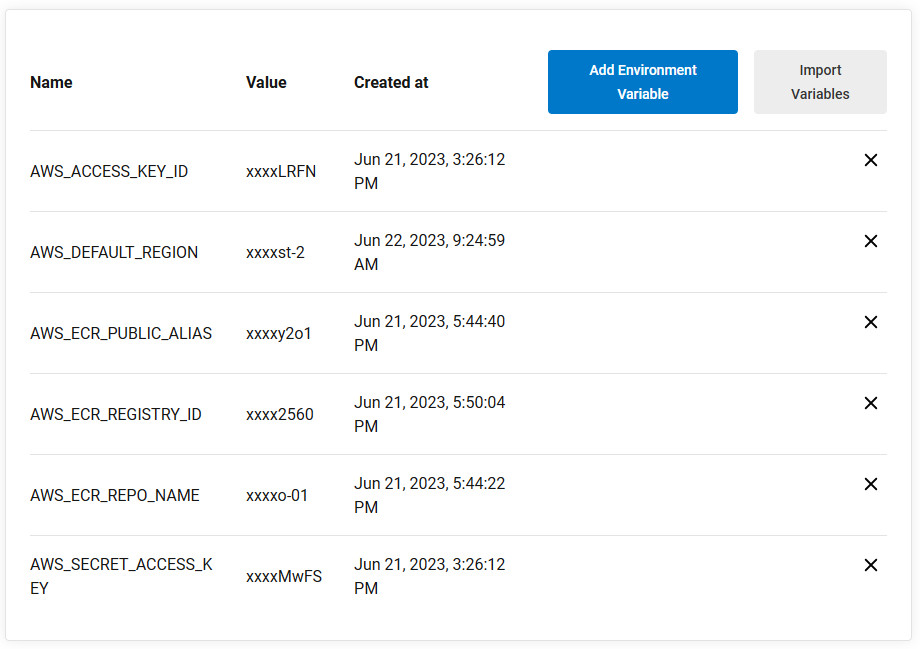

Tools used:
1. Trello - Project board 
2. CircleCi - CICD pipeline
3. Github - Repository for maintaining the code
4. Cloud - AWS
5. Containarization - Docker
6. Cluster - Kubernetes
7. Infrastructure as code - Terraform
8. Automation Testing - Cypress

We used the following ***Environment Variables*** to allow our CircleCI user to connet to AWS

The t3-kubed-infrastructure https://github.com/t3-kubed/t3-kubed-infrastructure contains the terraform files for spinning up the AWS infrastructure 
This will be executed as the pipeline in the CircleCI and the infrastructure will be created once the pipeline get completed.
The resources created as part of the infrastructure pipeline:
1. VPC
2. Subnet
3. ECR
4. EKS
5. NAT Gateway
6. Elastic IP
7. Internet gateway
8. Loadbalancer
9. Cloudwatch

Once the infrastructure pipeline got finished then the next step is to deploy the application and for this also Circleci will be used to build the application

The deployment.yaml should contain the port which is open for the application and the service.yaml file should contain the target port and open port for both the frontend and backend

The .env file should contain the url of backend with port

The config.yml file in the circlecli contains 2 steps one is for building the backend application and another is for building the frontend application.

The backend application need to be build first.

Steps in building backend:
1. Circleci is used to build and deploy the backend application
2. Docker image will be created for the backend project
3. The image will be uploaded to the AWS ECR
4. The cluster will be created in EKS
5. Kubectl will be installed in EKS
6. Delete the Deployment and service if already exist for the backend
7. Deploy the application using the image in ECR. Pods will be created
8. Network access will be created for the pods

Steps in building frontend:

1. The .env file in the frontend repo must be updated with the backend url which we get after deploying the backend service
2. Docker image will be created for the backend project
3. The image will be uploaded to the AWS ECR
4. The cluster will be created in EKS
5. Kubectl will be installed in EKS
6. Delete the Deployment and service if already exist for the frontend
7. Deploy the application using the image in ECR. Pods will be created
8. Network access will be created for the pods

Once the pipeline gets completed the service url will be displayed in the EKS -> Services -> Frontend service -> Loadbalancer url

We can use this url to launch the application.

The same url need to be passed as the environment variable to run the https://github.com/t3-kubed/t3-kubed-automationtesting automation testing pipeline.
